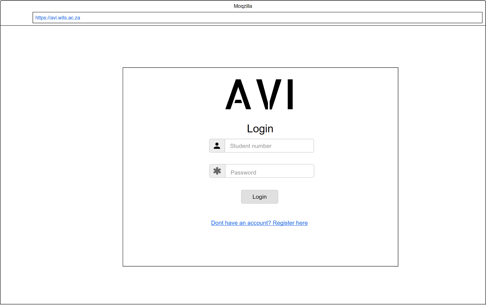
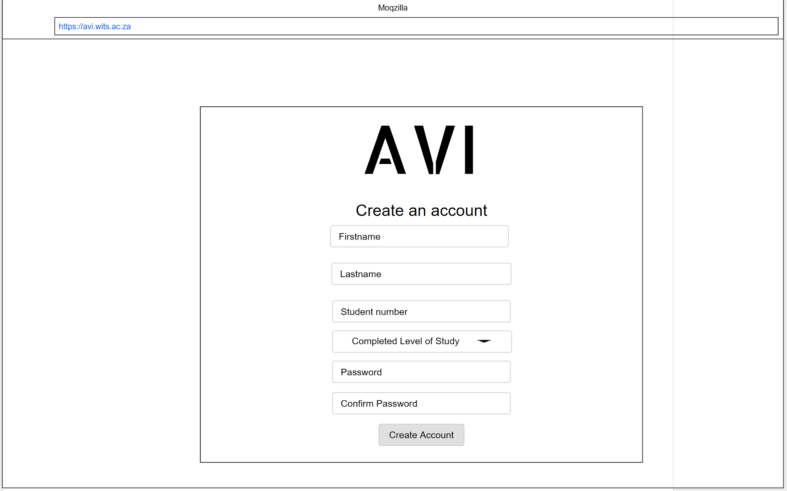
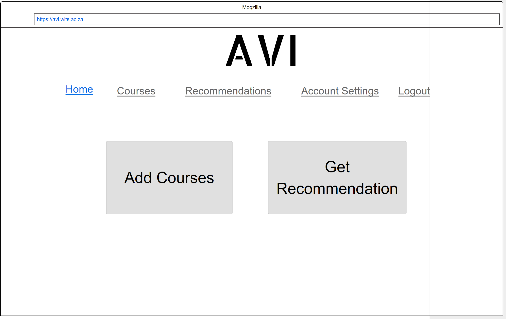
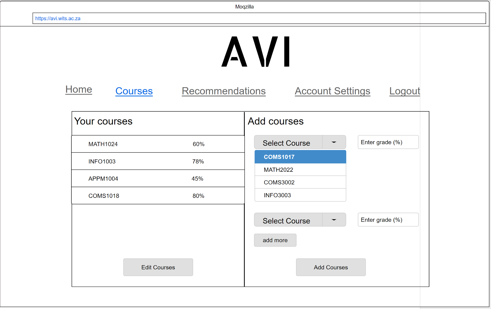
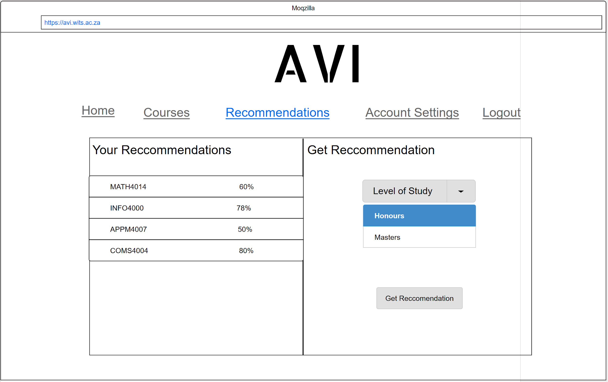
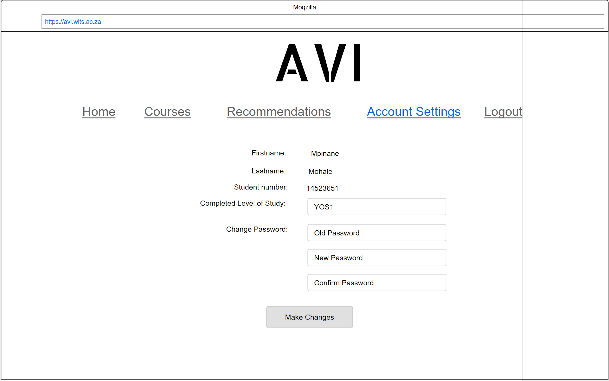
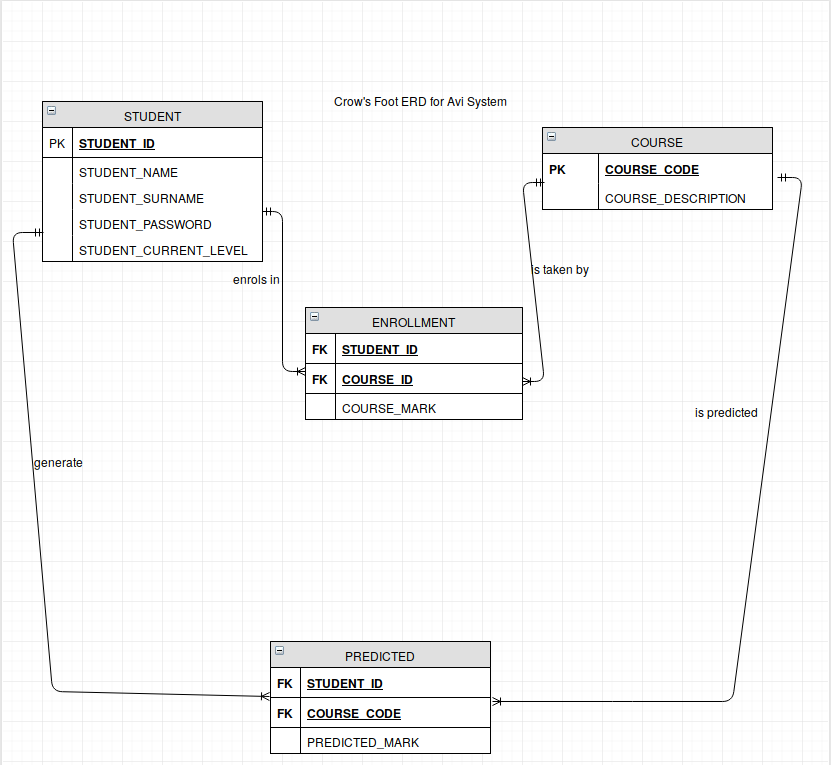
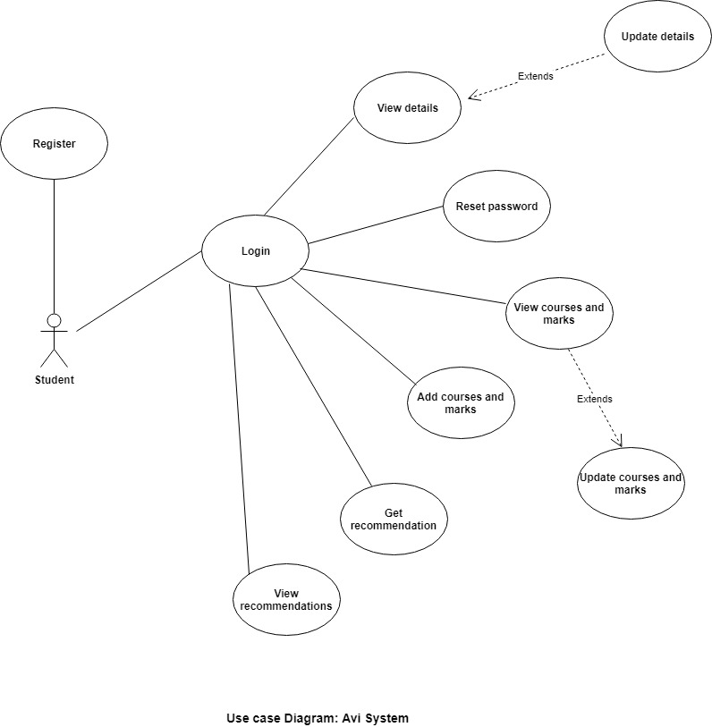

----------------------------------------------------------------------------------------------------------

                                          Prepared for
                                      Prof. E. J. Otoo
                                University of the witwatersrand  
                                
                                
                                          Prepared by
                                    Lucky Mahlangu(1395125)
                                    Mpinane Mohale(1363679)
                                    Sbusiso Mkhombe(1154046)
                                   Thulisile Shipyana(916781)
                                  
                                        

```{r fig.width=15, fig.height=40,echo=FALSE}
library(png)
library(grid)
img <- readPNG("wits1.png")
 grid.raster(img)
```
---------------------------------------------------------------------------------------------------------

```{r setup, include=FALSE}
knitr::opts_chunk$set(echo = TRUE)
```
\newpage


\section{1 Introduction}

\subsection{1.1 Problem Statement}
It is becoming more and more difficult, particularly for students entering graduate schools, to make decisions on courses that subsequently impact on their successful completion of graduate studies. Often, students have to choose from a number of electives in their specific programmes. 

\subsection{1.2 Purpose}
The purpose of this document is to detail the requirements for the Avi system to be developed. It will describe the features, functions and interfaces of the system. This document is intended for developers of the system as this document will serve as a guideline for the development of the Avi system. It is also intended for the client(The University of Witwatersrand) and serves as an indication of what the client should expect from the developed system. The approval of this document will be interpreted as permission to go ahead with the development of the system.  

\subsection{1.3 Scope}
Avi is a web application that will recommend elective courses to prospective postgraduate students and further predict the grades the students are likely to get in the recommended courses based on their grades in previously completed courses.

A student will start by creating an account which includes specifying their firstname, lastname, student number and their login password.

Once a student has created an account they can only be able to get recommendations once they have added the courses they have done, the year the course was completed along with the grade they obtained in each course. This information can be updated by the student for cases where they may have made a mistake or their mark has changed.

The student can now request to get recommendations. After requesting to get a recommendation, the student must specify the level of study they want recommendations for. After this the system will present to them the recommended courses along with the predicted grade for each course.

\newpage

\subsection{1.4 Definitions, Acronyms and Abbreviations}

*RAM* - Random Access Memory.

*CPU* - Central Processing Unit.

*ERD* - Entity Relationship Diagram.

*IEEE* - Institute of Electrical and Electronics Engineers, the world's largest technical professional organization.

*TCP/IP* - A set of rules that governs the connection of computer systems to the Internet.

*Client-Side* - The client-side environment used to run scripts is usually a browser.

*Server-Side* - A technique used in web development which involves employing scripts on a web server which produce a response.

*Use case diagram* - A use case diagram at its simplest is a representation of a user's interaction with the system that shows the relationship between the user and the different use cases in which the user is involved.

\subsection{1.5 Tools to be considered}

* *Python*- Python is an interpreted high-level programming language for general-purpose programming. Created by Guido van Rossum and first released in 1991, Python has a design philosophy that emphasizes code readability, notably using significant whitespace.

* *Django*- Is a free and open-source web framework, written in Python, which follows the model-view-template architectural pattern. It is maintained by the Django Software Foundation, an independent organization established as a 501 non-profit.

* *SQL*- Is a domain-specific language used in programming and designed for managing data held in a relational database management system, or for stream processing in a relational data stream management system.

* *scikit-learn*- Is a free software machine learning library for the Python programming language. It features various classification, regression and clustering algorithms including support vector machines.

\subsection{1.6 References }

* IEEE. IEEE Std 830-1998 IEEE Recommended Practice for Software Requirements Specifications. IEEE Computer Society, 1998.

* [https://www.wikipedia.com](https://www.wikipedia.com)

\newpage

\subsection{1.7 Overview }
*Existing System:*

* Currently students make their own decisions on which electives to take in that specific year of study.

* They use their own gut feeling to choose elective courses. On the other hand the faculty as well as their parents do not have the required domain knowledge to help them choose the right elective courses. 

*Existing System:*

* Bad choice of elective courses can have a direct impact on that student's academic performance.

* It can further limit the student's ability to reach their future goals in other words this will simply demoralize the student.

* In the end this results to students dropping out of courses in the middle of each semester.


*Our Plan:*

* Registration - unregistered users of the system will be able to register so that they can access to the system.
* Login - after successful registration users a required to login using their created username and password.
* A registered user/student is then able to insert the courses they are currently taking or have taken together with their mark to be captured by the system.
* Get/view recommendation - a student.
* A registered user should also be able to reset password.

\section{2 Overall Description}

\subsection{2.1 Product Perspective}

The Avi system is the first of its kind at the University of Witwatersrand. It is independent and totally self contained. Currently recommendations are provided by the faculty based on their observations of other students’ performance there is no formal or reliable system or methods for providing these recommendations.
\newpage

\subsection{2.2 User Interface}

*Login Page:*

{width=390px}

This is the first page that any user sees. If the user already has an account they should be able to login by entering their student number and password in the provided fields and clicking on the ”Login” button which would then direct them to the Home Page. A user that has not created an account should be able to click on the “Don’t have an account?Register here” link which will direct  them to the Create Account Page.

----------------------------------------------------------------------------------------------------------------------

*Create Account Page:*

{width=390px}

On this page the user should be able to create an account by filling in their Firstname, Lastname, Student number, Completed Level of Study, setting their password and then clicking on the “Create Account” button. Once they create account button has been clicked, the user will be taken back to the Login Page so that they can login.

\newpage

*Home Page:*

{width=390px}

Once the user has logged in, this is the page they will see. On this page they can either choose to view their courses by clicking on “Courses” in the menu, view their recommendations by clicking the “Recommendations” in the menu, add courses by clicking on the “Add Courses” button or get recommendations by clicking the “Get Recommendation” button. When the “Add Courses” button or “Courses” is clicked, the user will be directed to the Courses Page and when the “Get Recommendation” button or “Recommendations” is clicked, the user will be directed to the Recommendations Page. Note that only users who have added courses will be able to get recommendations.

-------------------------------------------------------------------------------------------------------------------

*Courses Page:*

{width=390px}

On this page the user can see the courses they have entered  and are able to edit them. They can also add more courses on the right side of the page by entering the course coode and the grade obtained in the course. Multiple courses can be added at once by clicking the “add more” button so that more input fields are generated. Once the user has entered the courses and their grades, they must click on the “Add Courses” button and the courses will be successfully added and will appear under.

\newpage

*Recommendations Page:*

{width=390px}

On this page the user can see their recommended courses and they can request to get a recommendation. To get a new recommendation the user must specify a level of study and then click on the “Get Recommendation” button. Once the button has been clicked, the recommended courses will appear under “Your Recommendations”.

------------------------------------------------------------------------------------------------------------------

*Account Settings Page:*

{width=390px}

This page is reached by clicking on “Account Settings” in the menu. On this page the user can change their completed year of study and/or their password. To change their completed year of study they must enter a new value in the provided field and then click the “Make Changes” button. To change their password they must provide their old password as well as the new password in the provided fields and then click the “Make Changes” button. To  change both the year of study on password at the same time, the user must perform the above 2 steps and only click the “Make Changes” button once all necessary fields have been filled in.

\newpage

\subsection{2.3 Software Interfaces}

*Client Side:*

The “Avi” system can run on any browser but the preferred browsers are Firefox (version 61.0.2 or latest), Microsoft Edge (version 41.16299.611.0 or latest) and Chrome(version 68.0.3440.106 or latest) since the system will be tested on these browsers. 

*Server Side:*

* The system can run on Linux Ubuntu 18.04LTS or Windows 10.
 
* The “Avi” system will be run on the Django Framework’s server which comes with the installation of the framework. The database for data storage and retrieval will be stored on the University of Witwatersrand MySQL Server LAMP. 

\subsection{2.4 Hardware Interfaces}

*Client Side:*

The user needs a device that has internet connection and one of the browsers mentioned in the next section.

*Server Side:*

Since this system will not be deployed, the hardware requirements are a laptop or desktop with a intel Core i7 CPU or better.
For the database, the University of Witwatersrand’s LAMP server will be sufficient

\subsection{2.5 Communication Interfaces}

The “Avi” system uses http/https protocol for communication (over the Internet) with the MySQL database and TCP/IP for intranet communication with the backend hosted locally on a laptop or desktop. 

\subsection{2.6 Memory Constraints}

*Client Side:*

None.

*Server Side:*

* The minimum storage requirements to store the application are 150MB.

* The minimum RAM requirement is 8GB.

\newpage

\subsection{2.7 User Characteristics}

The user will be expected to have completed or have some amount of tertiary education where they have had abundant exposure to technology, mostly laptops and desktops. This means  that heir technical expertise is be adequate enough to use the Avi system.

\subsection{2.8 Constraints}

The software will impose minimal constraints on its own. Any constraint will be largely attributed to the browser used instead of software limitations.

\subsection{2.9 Assumptions and Dependencies}

* The Linux Ubuntu 18.04LTS or Windows 10 software should be installed on the server side machine.

* The required browsers will be available on the client side machines.

\subsection{2.10 ER Diagram}

*Crows Foot ERD:*

{width=450px}

\subsection{2.11 Use Case Model}

*Use Case Diagram: Avi System*

{width=550px}
\newpage

\section{3 Specific Requirements}

\subsection{3.1 Functional requirements}

*Students class:*
* Registration - unregistered users of the system will be able to register so that they can access to the system.

* Login - after successful registration users a required to login using their created username and password.

* A registered user/student is then able to insert the courses they are currently taking or have taken together with their mark to be captured by the system.

* Get/view recommendation - a student.

* A registered user should also be able to reset password.

------------------------------------------------------------------------------------
                        
                                                
 *Use Case*                |  *Description*
-------------------------- | --------------------------------------------------
                           |
Register                   | Unregistered students have to register
-------------------------- | --------------------------------------------------------
login                      | The student has to login to get access into the system 
-------------------------- | ---------------------------------------------------------
Update details             | The student will be able to edit his/her details   
-------------------------- | ----------------------------------------------------------
View details               | A student will be able to view their details   
-------------------------- | ----------------------------------------------------------
Add courses and marks      | A registered student has to be able to add courses and along with their marks
-------------------------- | -----------------------------------------------------------
View courses and marks     | The student will be able to see the added courses with their marks
-------------------------- | -----------------------------------------------------------
Update courses and marks   | The student will be able to make changes to the added courses with their marks
-------------------------- | ------------------------------------------------------------
Reset password             | A student will be able to reset his/her password if forgotten
-------------------------- | ------------------------------------------------------------
Get recommendation         | Based on the marks entered the students can get a recommendation of courses to take from the system
-------------------------- | ---------------------------------------------------------------
View recommendations       | The student will be able to see previously made recommendations

\subsection{3.2 Inputs and Outputs}

*Possible Inputs:*

* Student Profile.

* Courses completed and their marks
  + For honours or masters based on user selection.

*Possible Outputs:*

* Recommended Courses.

* Expected Grades.

The Student Profile consists of the student’s Firstname, Lastname, Student number and their password.
The undergraduate results should be integers ranging from 0 – 100 and will be directly linked/ related to output i. Computer Science undergraduate courses are higher ranked in the decision-making process, the supplementary courses are considered after and then final decision is made from a calculated weighing of the main and supplementary courses of the results.

\subsection{3.3 Functions}

* The system shall check the validity of data.
* The system shall handle errors and invalid data.
* The system shall check for data overflow, check that the number of simultaneous user access request can be handled to avoid malfunction, bugs and system crashes.
* The system shall be logged to monitor admin access and security breaches.
* The system shall use data mining techniques to properly group students into clusters accordingly.
* The system shall use formulas for calculating expected grades derived from previous similar students using techniques such as statistical correlation.
* The system shall then recommend courses which the student may consider choosing.
* The system shall return expected grades for those recommended courses.

\subsection{3.4 Performance Requirements}

* The system is not expected to handle unreasonably large amounts of data.

* The system will expect integer values for academic results and will avoid string inputs using drop down selection and similar implementations.

* The system will be able to process student input - clusters comparisons within two minutes from run time.

* The system will be able to accommodate up to 1000 simultaneous users.

\newpage

\subsection{3.5 Logical Database Requirements}

*Type of variables to be used in database:*

* Integers.
* Converted Strings.
* Protected Strings.
* Floats

Variables will be checked for validity and range correspondence. 
Variables such as integers will have a higher frequency retrieval from the database. 
Sensitive information already in the database such as identity and student numbers should be locked from retrieval and have limited access – such as admin access only.

\subsection{3.6 System Software Requirements}

* The system should keep checkpoints every 6 hours and restart daily at an allocated time -preferably at night- to avoid malfunctions.
* The system should check for errors on a regular interval and use checkpoints to recover from any error if needed.
* The system will keep security logs to verify admin access, user access attempts, and privilege information access.
* The system should check for data integrity to avoid corrupted and malicious data for critical variables.
* The system should utilize cryptographic techniques for database encryption such as RSA encryption or Prime Factorization.

\subsection{3.7 Design Constraints}

* The system will be design using python on the django framework.

* The system must comply with the IEEE standards.

\subsection{3.8 Other Requirements}

Data retention and other user specific data related storage will not be implemented and user information will be deleted as soon as they deactivate or delete their account off the server.

\newpage

\section{4 Gathering and Preparing Data}

## Data Collection and Preparation

* Since the project is still in its preliminary phase, artifitial data will be generated to keep the project going, however as the project progresses it is worth noting that real data must be used to ensure that the trained machine learning classifier is properly validated.

* It is convenient to work with data that is artificially generated, it saves us from cleaning the data and performing all the data mangling techniques as well as slicing and dicing features.

* Upon generating the datasets, we can take care of the following cases:
  + Ensure that there are no duplicates in the CSV files.
  + Ensure that all the rows have data associated with the corresponding features(*There are no missing values*)
  
* One primitive hoslistic approach that will be used to generate the datasets is *string manipulation*, *string manipulation* involves processing or transforming string objects into a desired format or structure. One way of achieving this, is using regular expressions.

* To increase cohesion between features, we may consider to not include outliers in the generated datasets, on the other hand we must impose some constraints on the values that are taken by the features.

* To give some sense into our data , we must consider using probability distributions, and focus widely on distributed values.

* New datasets can be derived by merging datasets that are already created some primitive functions that can be used to merge datasets include:
  + Concatenation
  + Join
  + Merge

## Data Analysis and Model Selection

* Before choosing any classifier to use as a predictor, we need to carefully analyze the generated datasets and visually represent the data using various graphical methods. We need to carefully inspect each feature.

* As part of our preliminary techniques, we will start brute forcing the problem by using the following machine learning techniques:
  + Logistic Regression
  + K-Means Clustering
  
* *Logistic Regression-*Logistic Regression is used when the dependent variable(target) is categorical.

* *K-Means Clustering-*K-means clustering aims to partition n observations into k clusters.

\newpage

\section{5 The Dataset}

*STUDENTS DATA*

* The student dataset contains approximately 5494 artifitially generated students information. The information include , each student's ID, Name, Surname and the current year completed.

*FIRST_YEAR DATA*

* The first year dataset contains approximately 10 real first year Computer Science course codes as well as their descriptions.

*SECOND_YEAR DATA*

* The second year dataset contains approximately 12 real second year Computer Science course codes as well as their descriptions.

*THIRD_YEAR DATA*

* The third year dataset contains approximately 21 real third year Computer Science course codes as well as their descriptions.

*HONOURS DATA*

* The honours dataset contains approximately 14 real honours Computer Science course codes as well as their descriptions.

*MASTERS DATA*

* The masters dataset contains approximately 17 real master Computer Science course codes as well as their descriptions.

# Variable Dictionary

The six datasets (STUDENTS.csv ,FIRST_YEAR.csv ,SECOND_YEAR.csv ,THRID_YEAR.csv ,HONOURS.csv ,MASTERS.csv) contain the following 8 variables.

1. *STUDENT_ID[Numerical Unique code]*, Student Numbers.

2. *STUDENT_NAME[String]*, Names of Students.

3. *STUDENT_SURNAME[String]*, Surnames of Students.

4. *STUDENT_PASSWORD[String]*, Students personal passwords of length 8.

5. *STUDENT_CURRENT_LEVEL[String]*, Students current level of study, values taken 'YOS3' or 'HONOURS'.

6. *COURSE_CODE[Unique String]*, Course code.

7. *COURSE_DESCRIPTION[String]*, Description of the course.

8. *COURSE_MARK[Numerical Value]*, Mark achieved by a student in a particular course. 

\newpage 

# Members’ Responsibilities:

*Mpinane Mohale:*

* Create prototype/wireframe
* Find libraries/frameworks to use for UI Design
* Implement UI
* Predict grades(Using Machine Learning)

*Lucky Mahlangu:*

* Compile Final Document
* Generate Data
* Database setup(creating tables)
* Recommend courses(Using Machine Learning)

*Thulisile Shipyana:*

* Find libraries/frameworks to use for UI Design
* Implement UI
* Database setup(creating tables)
* Register & login

*Sbusiso Mkhombe:*

* Register & login
* Data input(add, edit, delete)

# Meeting Times:

* Monday: 14:00 - 17:00
* Wednesday: Whatsapp check in
* Friday: 19:00 - 21:00

# Github Repository

[https://github.com/Mpinane/SoftwareEngineeringProject_Group3.git](https://github.com/Mpinane/SoftwareEngineeringProject_Group3.git)