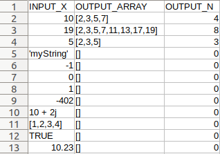
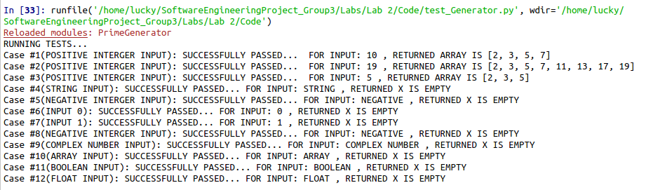
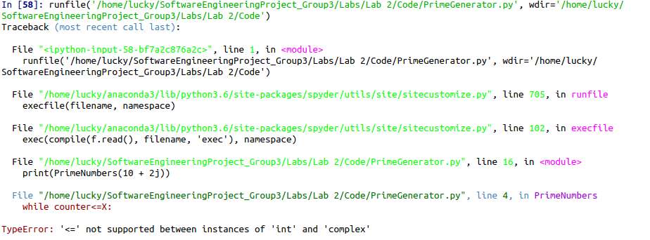
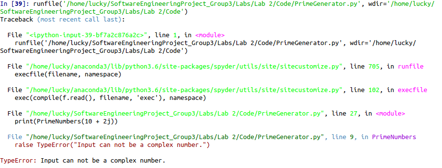
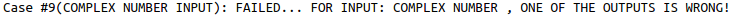
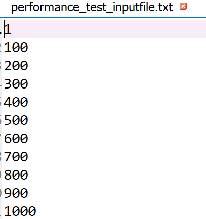
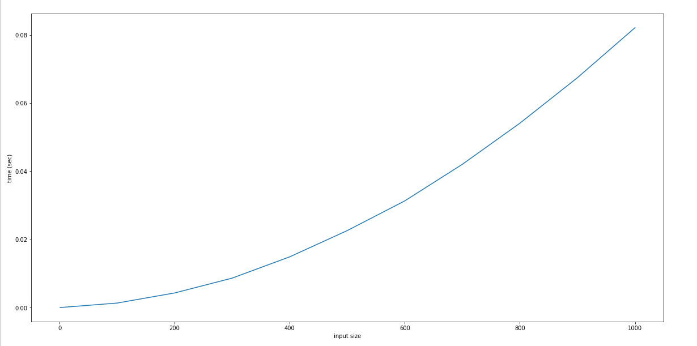

```{r setup, include=FALSE}
knitr::opts_chunk$set(echo = TRUE)
```

----------------------------------------------------------------------------------------------------------

                                          Prepared for
                                      Prof. E. J. Otoo
                                University of the witwatersrand  
                                
                                
                                          Prepared by
                                    Lucky Mahlangu(1395125)
                                    Mpinane Mohale(1363679)
                                    Sbusiso Mkhombe(1154046)
                                   Thulisile Shipyana(916781)
                                  
                                             

```{r fig.width=15, fig.height=40,echo=FALSE}
library(png)
library(grid)
img <- readPNG("wits1.png")
 grid.raster(img)
```


# Github Repository

[https://github.com/Mpinane/SoftwareEngineeringProject_Group3.git](https://github.com/Mpinane/SoftwareEngineeringProject_Group3.git)   
---------------------------------------------------------------------------------------------------------


\newpage

# Table of Contents


\section {1 Introduction}

1.1 Problem Statement...................................................................................(3)

1.2 Purpose.............................................................................................(3)

1.3 Scope...............................................................................................(3)


\section {2 Unit Testing on the Prime Number Generator Module}

2.1 Definition..........................................................................................(4)

2.2 Participants........................................................................................(4)

2.3 Methodology........................................................................................(4)

2.3.1 Input File........................................................................................(4)

2.3.2 PrimeNumbers() Module Pseudocode...............................................................(5)

2.3.3 Proof for Correctness ofPrimeNumbers..............................................................(5)

2.3.4 Implementation of the PrimeNumbers Module......................................................(6)

2.3.5 Testing...........................................................................................(7)

\section {3 Performance and Stress Testing Definition}

3.1 Definition..........................................................................................(10)

3.2 Participants........................................................................................(10)

3.3 Methodology........................................................................................(10)

3.4 Complexity of PrimeNumbers.......................................................................(11)

\newpage


\section{1 Introduction}
\subsection{1.1 Problem Statement}
 In today's world, industries are in demand of software applications and they tend to put a lot of pressure to the current existing tech companies to deliver these software packages in a short period. In particular, software engineers and developers must be efficient when developing these  software packages. Hence we introduce the most important part of the software development life cycle called *testing*.
 
We do software application *testing* mainly because of one fact, we want to avoid having many software bugs at the end of production. If that's not the case companies will need to spend a lot of money in releasing new different versions of the same software each time.

Given the sensitivity of a software it is imperative for a software developer to run tests at each and every iteration of the project starting from the requirements phase, this will effectively minimize the amount of bugs the software might have at the end of production.

\subsection{1.2 Purpose}

The main purpose of this document is to analyze, design and develop optimal testing and debugging procedures for the *PrimeNumbers()* module. This includes how to conduct:

* Unit testing
* Performance and Stress Testing


\subsection{1.3 Scope}
For this lab we are required to develop and implement a function *PrimeNumbers()* that takes a positive integer number X, and generates all prime numbers less than or equal to X, we are then required to develop and write a main program that serves as a test-driver to test various scenarios of possible misuse and proper use of this module. Error codes must be returned if invalid inputs are taken in by the module.

\newpage

\section{2 Unit Testing on the Prime Number Generator Module}

\subsection{2.1 Definition}

* Used to check the individual components of the code for defects and bugs.
* Helps maintain code and ensures easier debugging.
* Ensures unit code re-usability in other developments.
* Helps combat code defects earlier which might have been costlier to fix at a higher level.
* Ensures code reliability
* Tested that all possible code input, desired or not was accounted for. 
* Tested that all possible code input produced output or error message.

\subsection{2.2 Participants}

* Sbusiso Mkhombe 
* Lucky Mahlangu

\subsection{2.3 Methodology}

\subsection{2.3.1 Input File}

*Figure 1: Sample Input File*
{width=200px}

Above is a sample Input File, the file has an extension ".csv" and it consists of three features namely INPUT_X, OUTPUT_ARRAY and OUTPUT_N.
The PrimeNumbers() module will take in inputs directly from the csv and performs all the necessary computation required.

INPUT_X: The column has some possible inputs that can be taken in by the PrimeNumber() module , some inputs will return the desired prime numbers array whereas some will return an empty array and an error message if they are invalid inputs. *E.g* from the input file above  in all inputs in line 2 to 4 will return the desired output array. On the flip side all the inputs from line 5 to 13 are invalid hence the function will return an empty prime array as well as an error message. 

*Valid Inputs:* 

* lines 2-3: All positive long integers greater than or equal to 2

*Invalid Inputs:* 

* line 5: Strings 
* lines 6-9: All long integers less than 2
* line 10: Complex Numbers
* line 11: Arrays
* line 12: Booleans
* line 13: Floats

OUTPUT_ARRAY: The column has some possible output arrays, if the output array has at least one element is means that the input was successfully passed into the function thus valid. On the hand if the output array is empty, this simply means that the input is invalid.

OUTPUT_N: The column has the lengths of each corresponding output arrays. *E.g* In line 1 the output array has elements [2,3,5,7], thus the length of this array is 4. And if the array is empty [], then the length is defined to be 0.

\subsection{2.3.2 PrimeNumbers() Module Pseudocode}

|**Algorithm: PrimeNumbers(X)**                                                                                                 |
|------------------------------------------------------------------------------------------------------------------------------ |-----
|*Input:X, where X is a positive long integer.*                                                                                 |
|                                                                                                                               |
|*Output:Primes[],N, where Primes is an array of prime numbers less than X, and N is the length of Primes.*                     |                                 |                                                                                                                               |
|                                                                                                                              
|01 ~*Primes $\leftarrow$[]*
|02 ~*counter $\leftarrow$ 2*
|03 ~*While counter<=X*
|04 ~~~~*isPrime $\leftarrow$ True*
|05 ~~~~*For i from 2 to X*
|06 ~~~~~~~*If mod(counter,i)==0 and (counter not equal to i)*
|07 ~~~~~~~~~~*isPrime $\leftarrow$ False*
|09 ~~~~~~~~~~*break*
|10 ~~~~*If isPrime*
|11 ~~~~~~~*add counter into Primes*
|12 ~~~~*counter $\leftarrow$ counter+1*
|13 ~*N $\leftarrow$ size of Primes*
|14 ~*Return Primes and N*

**Note:** Not all algorithms return the correct answer when fed with a valid input, i.e the fact that the input is valid does not ensure that the outputs will be correct. Hence, below we prove the correctness of this algorithm using proof by mathematical induction.

\subsection{2.3.3 Proof for Correctness of PrimeNumbers}

## Proof by Induction

We will use proof by induction to show that the algorithm  *PrimeNumbers* will return the correct array and the output N for any *valid input*. The formal problem statement is as follows:

**Theorem :** *PrimeNumbers* computes corretly for any valid input.

*Proof.*

**Base Case:**

Let the number inputted be 2. The algorithm first initializes Primes to be an empty array, it then sets counter to be 2, followed by testing the condition of the *while* loop. The condition counter $\leq$ X is tested and passes (2 $\leq$ 2), the algorithm moves to the next line and sets isPrime to True. Then the *for* loop in line 05 is executed, for each pass of the *for* loop the body of the loop is executed, that is, the two conditions of the *if* statement are executed. The first condition checks for mod(counter,i)==0 which passes (mod(2,2)==0), that is, 2 is divisible by 2 but the second condition counter is not equal to i fails because (counter=2=i). Likewise, for all i not equal to 2, mod(counter,i)!=0, in conclusion the body of the if statement will never be executed for all passes of the *for* loop thus isPrime will remain True. Thus, the *if* statement in line 10 will be passed, next the algorithm will execute line 11 , adding counter=2 into Primes. Line 12 increments counter to 3, going back to line 03 counter=3 $\leq$ X=2 fails, making the *while* loop to stop executing. Then line 13 sets N to be the length of Primes which in this case is 1. Therefore, the algorithm returns Primes=[2] and N=1 as expected.

The algorithm works for an input of X=2. The *Base Case holds True*.

**Induction Hypothesis:**

Assume that *PrimeNumbers* returns the correct answer for an input k, where k > 0.

**Induction Step:**

We need to show that the algorithm returns the correct answer for an input k+1, after executing the k-th iteration of the algorithm we then make an extra iteration called the (k+1)-th iteration. counter will be having the value k+1, thus the body of the *while* loop in line 03 will be executed. isPrime will be set to True. We therefore consider two cases(Case 1: k+1 is not a prime number, Case 2: k+1 is a prime number), the first case occurs when the *if* statement in line 06 is passed, setting isPrime to False thus, breaking out of the *for* loop, then the condition in line 10 will be false because isPrime is False. Thus, k+1 will not be added in the Primes array since it is not a prime number as expected, then by the *Induction Hypothesis* the algorithm will return the correct array. Now considering case two, the *if* statement in line 06 fails, the body of the *if* statement will not be executed. Then line 10 passes since the value of isPrime is still True, then k+1 will be added in the Primes array, since it is a Prime number, by the *Induction Hypothesis* the algorithm will return the correct array.

Thus by the principle of mathematical induction our result is proved.

Therefore, *PrimeNumbers* computes correctly for any valid input.

**Note:** This still needs to be tested using our test program.


\subsection{2.3.4 Implementation of the PrimeNumbers Module}

```{python}
def PrimeNumbers(X):
    primes=[]
    counter=2
    while counter<=X:
        isPrime=True
        for i in range(2,X):
            if (counter % i)==0 and (counter!=i):
                isPrime=False
                break
        if isPrime:
            primes.append(counter)
        counter=counter+1
    N=len(primes)
    return primes,N
```

Running the function: Just call the function with an argument say 9, thus the function should generate prime numbers that are less than or equal to 9.

```{python}
print(PrimeNumbers(9))
```

The function returns a tuple ([2, 3, 5, 7], 4), where [2,3,5,7] is the array of primeNumbers less than or equal to 9. And 4 is the length of the array.

**Note:** The next step is to test the above module.

\subsection{2.3.5 Testing}

Now suppose that we want to test whether the algorithm implemented in section 2.3.5, returns valid outputs and the correct error messages when called with various inputs. 

**Note:** The way the test function works is it passes all the inputs given in the input file into the PrimeNumbers module one  by one till the end of the file. It then compares the desired outputs given in the file with the ones that are returned by the function, if the outputs match correctly the test will be "SUCCESSFULLY PASSED" if not the test will "FAIL". On the other hand the test function , also checks for the validity of inputs, for example if the function is fed with an input type of a float, it is going to print a message on the console saying that the data type inputted is a float and as a result it will return an empty array message and a length of 0, since a data type of float cannot successfully generate prime numbers because the expected data type is a long integer.


*Figure 2: Tests - Using the Input File given in section 2.3.4*.

{width=600px}

**Note:** There were 12 tests ran overall since we only called the PrimeNumbers module with 12 inputs.

## Brief Description

For simplicity *case #1* will be taken as an example, it is worth noting that in line 2 of our input file in Figure 1(section 2.3.4), we have INPUT_X=10 and the expected outputs are, OUTPUT_ARRAY = [2,3,5,7] and OUTPUT_N = 4. After Running our PrimeNumbers module with X=10 we get:

```{python}
print(PrimeNumbers(10))
```

Thus, comparing the two it is very clear that they are the same hence *case #1* will be "SUCCESSFULLY PASSED" as stated in Figure 2. Figure 2, line 2 also shows that the type of input given was a long integers.

# Loop Hole :(

Now suppose we go to the input file in Figure 1(section 2.3.4) in  *case #9* and we change the expected OUTPUT_ARRAY = [2] and OUTPUT_N=1, take note that the INPUT_X = 1 + 2i which is a complex number. Likewise, we call our module PrimeNumbers with X=1 + 2i.

print(PrimeNumbers(1+2i)), we are going to be presented with the following error message :

{width=600px}

*Program crashed:* To fix this we just need to alter the PrimeNumbers module to take cases as presented below :

```{python}
def PrimeNumbers(X):    
    if type(X) == int and X < 2:
        raise ValueError("Integer has to be equal to or greater than 2.")
    elif type(X) == list :
        raise TypeError("Input can not be a list or array.")
    elif type(X) == bool:
        raise TypeError("Input can not be boolean.")
    elif type(X) == complex:
        raise TypeError("Input can not be a complex number.")
    elif len(str(X)) >= 10:
        raise ValueError("Input too Large.")
    elif type(X) not in [int]:
        raise TypeError("Please Enter a Postive Integer.")
    
    primes=[]
    counter=2
    while counter<=X and counter < sys.maxsize+1:
        isPrime=True
        for i in range(2,X):
            if (counter % i)==0 and (counter!=i):
                isPrime=False
                break
        if isPrime:
            primes.append(counter)
        counter=counter+1
    N=len(primes)
    return primes,N
```

\newpage

Now try calling PrimeNumbers module again:

{width=600px}
The program does not necessarily crash, instead we throw a sophisticated error message.

And the test program will give :

{width=600px}

This is as expected beacause we intentionally changed the expected OUTPUT_ARRAY to [2] and the OUTPUT_N to 1.

----------------------------------------------------------------------------------------------------------------------------------------------------

\newpage

\section{3 Performance and Stress Testing Definition}

\subsection{3.1 Definition}
Performance and stress testing is the process of determining the responsiveness and stability of the PrimeNumbers function under different workloads i.e. given different inputs that require a lot of little computation/processing power.

\subsection{3.2 Participants}
* Mpinane Mohale

\subsection{3.3 Methodology}

The test scripts for this test will be written by Mpinane Mohale.

The test script reads in an input file with the name “performance_test_inputfile.txt”.

The input file consists of rows of possible values of X (the input argument for the PrimeNumbers function). The values must be inputted in a linear ascending order. An example of the file is in the figure below

{width=300px}

Once the file has been read in, the PrimeNumbers function is tested using each row in the file and the performance of the function foreach input is plotted on a graph. 

A theoretical analysis of the PrimeNumbers algorithm was performed to assess its performance as seen in section 3.4 below.

\newpage

\subsection{3.4 Complexity of PrimeNumbers}

In this algorithm, the most work is done in the for loop so counting how many times the loop executes would be a fair estimate of the algorithm’s performance.
For any given valid value of X (let’s say n >= 2) the while loop executes n-1 times which means the for loop condition is checked n-1 times. Now, the for loop executes in various number of times depending on the value of counter but it could execute for a minimum of 1 times and a maximum of n-1 times.

Our best case is when $n=2$. In this case the complexity function is $g(n)=(n-1)(1)= n-1$ so the algorithm is $O(n)$.

Our worst case is when $n>=3$. In this case the complexity function is $g(n)=(n-1)(n-1)=n^2-2n+1$ so the algorithm is $O(n^2)$.

From our theoretical analysis of the PrimeNumber we expect the function to follow a $n^2$ - like pattern. This means that as the input increases the time increases quadratically. The result of the test script is a graph like the one below:

{width=600px}

**Note:** To run the test script:

You need to have installed matplotlib. 
To install matplotlib run this in the terminal:

* python -mpip install -U pip .
* python -mpip install -U matplotlib .

-----------------------------------------------------------------------------------------------------------------------------------------------------------
